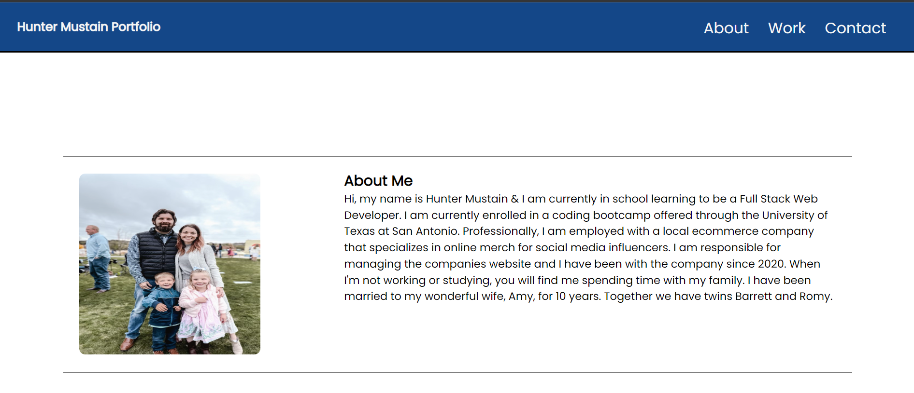
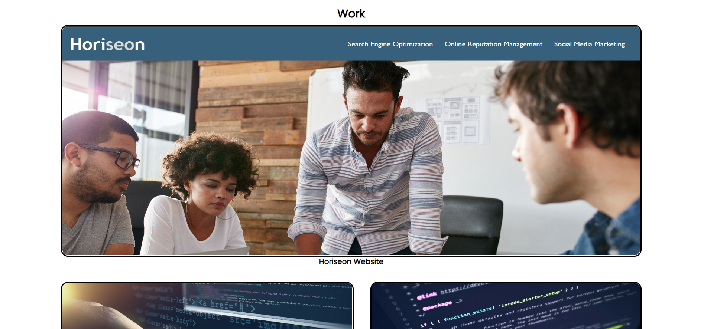
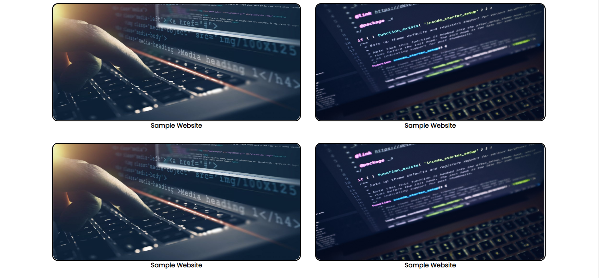
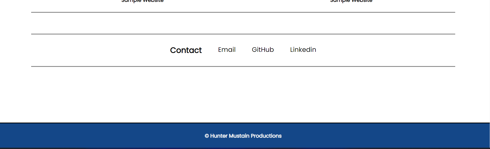

# Hunter-Mustain-Portfolio

## Description

This is a portfolio project. I was motivated to create this project for multiple reasons. 1) To apply new skills we learned in the class room to a real world webpage. 2) To get the frame work for my professional portfolio started, so that by the end of this bootcamp, my portfolio will be finished, polished, and ready to show the world what I can offer.

I built this project, to get the foundation for my professional portfolio started.

By having this project started, I am able to have a single, go to place, for potential clients and/or employers to see what I have to offer.

 I learned how to take skills we learned in class ie: HTML framework, semantic orders, CSS styling using flex-box and mobile responsive web design, and apply them to a real world web-site. This challenge was more difficult than the first, as we started with zero code on this one. By being a blank slate, I also learned how to utilize google, mdn, mozilla developer, w3, and youtube, to apply things from more seasoned developers and put them into my own.

## Table of Contents (Optional)
N/A

## Installation
N/A

## Usage
Screen shot of deployed page below

## Credits

Hunter Mustain  

## License

---

## Link to deployed page

https://hmustain.github.io/Hunter-Mustain-Portfolio/
